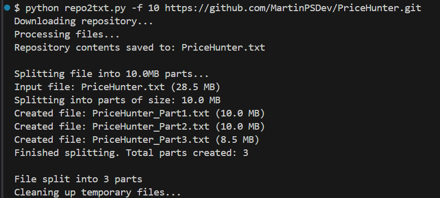

# repo2txt

Converts public Github repositories into txt files that can then be used by LLMs to help you analyze, modify, improve, train an AI, or whatever you need. Returns the entire folder, file, and code structure.


- 🪟 🐧  Cross-platform support 

## Installation

## Usage


```bash
 python repo2txt.py <repository-url>
```

### Example

```bash
python repo2txt https://github.com/username/repository
```
[@M4rt1n_0x1337](https://x.com/M4rt1n_0x1337)

### 🚀Updates
A new feature has been added so that if the file is very large it can be split into several smaller files that fit the maximum accepted by the LLM. The size of each file can be chosen with the parameter -f / --fragment followed by the number in megabytes.
```bash
$ python repo2txt.py -h 
usage: repo2txt.py [-h] [-f FRAGMENT] repo_url

Convert GitHub repository to text file

positional arguments:
  repo_url              GitHub repository URL

options:
  -h, --help            show this help message and exit
  -f FRAGMENT, --fragment FRAGMENT
                        Split output into files of specified size in MB
```

### Example




## License

MIT
